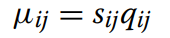

# **RNA-Seq Data Analysis**
**Differential Expression Analysis	- DESeq2 -**

- Introduction
- Algorithm
- Tutorial
- Analysis
- Application
- Related

## **Introduction**

**Differential expression**

**DESeq2**

DESeq2 is an analysis tool used to analyze the count data from RNA-Seq. It is available in R and Bioconductor packages. It is used to determine whether the genes are differentially expressed. The expressions of genes are tested using negative binomial generalized linear models (GLM). DESeq2 uses dispersion and logarithmic fold changes based on count data to determine which genes are differentially expressed. It also detects and corrects dispersion estimates that are too low through modeling of the dependence of the dispersion on the average expression strength over all samples.

## **Algorithm**

**Normalization**

Normalization is the first step of the data analysis process. It is also the most important step. With normalization, the expression levels of genes are more comparable between and within samples. After normalization, a GLM is fitted to each gene to determine the overall expression strength of the gene.
The read count is modeled as a negative binomial distribution with mean and dispersion. The mean is calculated using the equation below:

To get the mean *uij*, the quantity *qij* is scaled by the gene-specific normalization factor *sij*, which is also known as the size factor. *qij* represents the gene length, which is proportional to the concentration of cDNA fragments from the gene in the sample. Since *sij* is considered as a constant within a sample, it can be replaced by another constant, *sj*, which is a constant that can be used for all genes in a sample. *sj* accounts for differences in sequencing depth between samples. The constant is estimated using the median-of-ratios method shown below:

In the method, counts are divided by the sample-specific normalization factors determined by median ratio of gene counts relative to the geometric mean per gene.

The overall expression strength of the gene is determined using GLMs with a logarithmic link:

The design matrix element *xjr* is an element that indicates whether a sample *j* is treated or not. The GLM fit returns the coefficient *𝜷ir*, which indicates the overall expression strength of the gene. The GLMs also return the log2 fold change between treatment and control samples.

## **Tutorial** (Coming From FeatureCounts)

**Input Files:**
The input files for Deseq two are a count matrix and column data. The count matrix comes from featureCounts where the ith row and jth column describe the expression level for gene i in sample j. The counts must be raw in order for the statistical model for Deseq2 to hold true. The column data is a table with metadata on the count matrix columns. 

Figure 1: Example of a count matrix where the ith row and jth column describe the expression level for gene i in sample j. 

Figure 2: Example of column data, where the first column is the sample name, the second column is the patient type, the third column is the treatment type, and the fourth column is the amount of time for the treatment. The columns tell the metadata for each sample in a count matrix.

**Creating the DeseqDataSet (DDS) object:**
The DeseqDataSet object is the parameter for Deseq2. Since the count matrix comes from FeatureCounts, the DeseqDataSet object is created using the DeSeqDataSetFromMatrix command. This command takes in three parameters. The first is the count matrix. The second is the column data, and the third is the Design Condition. The design condition explains how the counts for each gene depend on the variables in column data. The command to create the DeseqDataSet object is: Dds <- DESeqDataSetFromMatrix (count matrix, column data, Design Condition).

**Running Deseq2:**
The Deseq2 command takes in a single parameter, which is the DeseqDataSet object. The command to run Deseq2 is: Dds <- DESeq(Dds). 

## **Analysis**

Results Table:
After running Deseq2, running this command: Results <- results(Dds), gives the results table. 

Figure 3: This is an example results table which shows you base mean (expression), log2FoldChange, lfcSe, Stat, and p-value for each gene.

The three most important results in the results table for differential expression are expression levels, log2Foldchange, and p-Values. The Log2FoldChange shows how much the gene’s expression seems to have changed due to treatment from sample to sample. Log2FoldChange is reported on a logarithmic base 2 scale. This means that a log2FoldChange value of 1.5 indicates that the gene’s expression increased by 2^1.5 = 2.82. The p-values show the confidence of the log2FoldChange value and indicate whether or not there is a differential expression. The p-value represents the probability that the results happened by random chance. 

**MA Plot:**

Figure 4: MA plot where the x-axis represents average expression and y-axis represents  log2FoldChange

The first common way to visualize the results from the results table is through an MA plot. In an MA plot, each gene is a point, and each point is colored if the p-value for the log2change of that specific gene is less than 0.1. Colored points indicate that there is enough evidence to conclude that the gene is differentially expressed. The x-axis represents the average expression for the gene, while the y-axis represents the Log2FoldChange for each gene. 

**Volcano Plot:**

Figure 5: Volcano Plot where the x-axis represents log2FoldChange and y-axis represents the significance values

The second common way to visualize the results from the results table is through a volcano plot. In a volcano plot, each point represents a gene, and a point is colored if the log2FoldChange meets a minimum threshold for p-value. A colored point represents a gene that is differentially expressed. In the Volcano plot, the x-axis represents log2Foldchange and the y-axis represents significance values. The right half of the plot represents genes that are upregulated, while the left half represents genes that are downregulated. The top of the plot represents the most statistically significant genes. 

